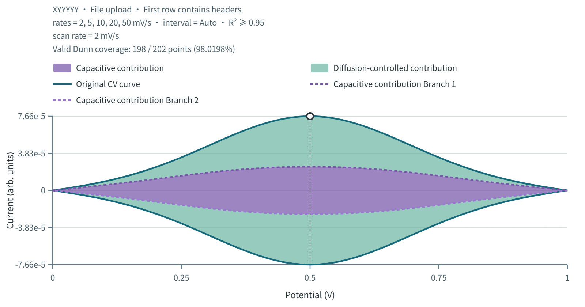

# CV 动力学分析

**b 值分析 · R² 引导的正则化 Dunn 重构 · 离线桌面工作流**

[English](README.md) · [在线工具](https://tmccdb.org/tools/cv-kinetics/) · [使用帮助](docs/HELP.zh-CN.md) · [更新记录](CHANGELOG.md)

支持完整 CV 曲线、b 值拟合、手动峰点调整和电容贡献可视化。如果项目对你有帮助，欢迎点亮 GitHub Star，方便更多人找到它。

*图片使用合成演示数据，不代表真实实验结果。*

## 功能

- 导入 CSV、TXT、XLSX，手动选择 XYYYYY / XYXYXY；支持 3–20 组扫速。
- 保留完整 CV 的原始扫描顺序与正反扫分支。
- b 值总览、单电位回归、手动增添与调整峰点，可明确选择分支。
- Dunn 阈值 / R² 加权两种模式，以及共享电容比例的正则化重构。
- CSV、SVG、PNG 导出；在表头勾选需要复制的列。
- 中英文界面、本机离线计算、内置帮助及手动更新。
- 桌面发行目标：Windows x64、Mac M 系列及 Mac Intel。

## 使用

[在线版](https://tmccdb.org/tools/cv-kinetics/)继续保留。离线桌面软件请从原获取 / 购买渠道取得，或联系维护者；本公开仓库不提供付费软件包下载。

导入 [examples](examples/) 中任意示例，选择 **XYYYYY、首行为表头**，核对扫速顺序为 **2、5、10、20、50 mV/s**，再运行分析。这些文件均为同一组合成数据。

## 公开范围

本仓库公开项目说明、帮助、合成示例、截图及示例生成代码；**不公开完整分析引擎和桌面源码**。完整源码可以申请，由维护者人工审核。申请时说明用途和 GitHub 用户名，不要把保密实验数据发到公开 Issues。

示例生成代码使用 `examples/LICENSE` 中的 MIT 许可，不代表完整软件也采用同一许可。

中文支持 / 源码申请：**bingwu233@gmail.com**。

## 科学使用提醒

正则化重构不等同于传统逐点 Dunn 拟合，贡献率依赖模型与设置。请同时检查原始 CV、分支及拟合质量，并在论文中记录版本、单位、R² 模式/阈值、电位间隔和转折点修剪设置。曲线平滑不等于机理已被唯一证明。
